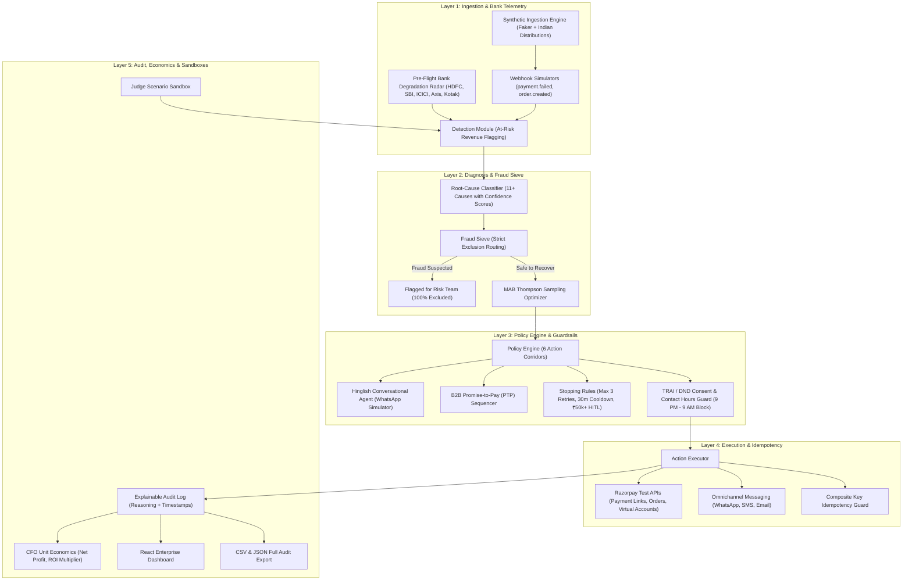

# Recovery AI — Autonomous Revenue Recovery Operating System
> **"Don't just identify the problem. Show measured money recovered across a batch, with compliant escalation, stopping rules, and an audit trail."**  
> — *Razorpay /buildathon 2026, Track 03: AI Revenue Recovery*

---

## Executive Summary

**Recovery AI** is an enterprise-grade autonomous revenue operating system built specifically for Indian digital commerce. It connects pre-flight risk prediction, failure detection, multi-signal root-cause diagnosis, policy decisioning, reinforcement learning optimization, and idempotent execution across the primary revenue degradation vectors:

1. **Payment Failure Recovery**: Card declines, UPI switch timeouts, bank network drops, 3DS authentication drop-offs, and gateway errors.
2. **Checkout Abandonment Recovery**: Abandoned high-intent carts nudged with bounded dynamic incentives (max 5%) via WhatsApp/SMS.
3. **Failed Subscription / e-Mandate Recovery**: UPI AutoPay and eNACH recurring mandate failures handled with smart retries and mandate re-registration links.
4. **B2B Receivables & Invoices**: Enterprise invoice aging management, automated Dunning sequences, and Promise-to-Pay (PTP) commitment tracking.

---

## 6 Breakthrough Innovations

### 1. Hinglish Autonomous WhatsApp Recovery Agent
- **Natural Code-Switching**: Communicates in natural conversational Hinglish (*"Namaste Rahul ji! Aapka ₹2,499 ka payment bank timeout ki wajah se fail ho gaya..."*), Hindi, or English.
- **Objection Handling**: Autonomously resolves customer friction points (*"Paise cut gaye par order confirm nahi hua"*, *"Abhi balance nahi hai, kal karunga"*, *"Thoda discount milega kya?"*).
- **Promise-to-Pay (PTP) Extraction**: Uses NLP regex & semantic parsers to extract customer commitments (e.g. *"Kal subah 11 baje"*), records the commitment date, and pauses aggressive nudges in compliance with TRAI regulations.
- **Dynamic UPI Smart Intent QR**: Generates zero-redirect UPI QR codes on the fly inside the conversation.
- **Bounded Incentives**: Grants dynamic instant recovery discounts strictly capped at 5% to prevent margin erosion.

### 2. Multi-Armed Bandit (MAB) Reinforcement Learning Optimizer
- **Thompson Sampling Engine**: Continuously optimizes the trade-off between exploration (discovering new channel/timing strategies) and exploitation (maximizing revenue on top-performing corridors).
- **Bayesian Posterior Modeling**: Updates Beta distributions ($\alpha, \beta$) in real time as recovery outcomes occur.
- **Lift Measurement**: Proves statistically significant conversion lift over static recovery heuristics.

### 3. CFO Unit Economics & Margin Analytics Engine
- **Net Merchant Profit Calculation**: Subtracts messaging delivery costs (WhatsApp ₹0.75, SMS ₹0.15, Email ₹0.02), discount expense, and Human-in-the-Loop (HITL) overhead from gross revenue recovered.
- **ROI Multiplier**: Delivers transparency on net margin percentage and cost per recovered rupee.

### 4. B2B Receivables & Promise-to-Pay (PTP) Sequencer
- **Aging Matrix**: Stratifies outstanding enterprise invoices into *Current*, *1–15 Days*, *16–30 Days*, *30–60 Days*, and *60+ Days (Critical)*.
- **Commitment SLA Management**: Automatically schedules reminders before the promised date and triggers automated escalations if the PTP SLA is breached.
- **Dispute Triage**: Distinguishes invoice/billing discrepancies from temporary cashflow delays.

### 5. Pre-Flight Bank Degradation & Predictive Risk Radar
- **Live Infrastructure Telemetry**: Real-time switch status for major Indian banks (HDFC, SBI, ICICI, Axis, Kotak) and NPCI UPI switch rails.
- **Predictive Risk Scoring (0–100)**: Evaluates switch latency, historical failure rates, and transaction amounts before attempting debits to route around degraded payment corridors and prevent retry storms.

### 6. Interactive Judge Scenario Sandbox
- **Custom Scenario Injection**: Judges can test **any** payment failure scenario, transaction amount (e.g. ₹95,000 Mandate Timeout), payment method, and DND/consent parameters.
- **Real-Time 5-Layer Execution Trace**: Instantly renders the diagnosis confidence, fraud sieve check, stopping rules validation, policy assignment, and final execution log.

---

## 5-Layer Architecture



---

## Rubric Deliverables Alignment

| Rubric Criterion | Implementation & Proof Point |
|---|---|
| **1. Measured Money Recovered** | Live batch calculations computing total at-risk amount, recovered rupees (₹), recovery rate (%), and net merchant profit after messaging and discount costs. |
| **2. Compliant Escalation** | Full TRAI / DND verification, strict contact hours (9 PM–9 AM quiet hours blocked), multi-channel consent enforcement (WhatsApp, SMS, Email). |
| **3. Stopping Rules** | Hard-coded non-optional guardrails: Max 3 retries, 30-minute cooldown period, ₹50,000+ mandatory Human-in-the-Loop (HITL), 5% discount ceiling. |
| **4. Audit Trail** | Every single decision logged with confidence scores, policy reasoning, trace IDs, and available for instantaneous JSON & CSV export. |

---

## Quick Start

### 1. Prerequisites
- Python 3.11+
- Node.js 18+ and npm

### 2. Backend Setup (FastAPI)
```bash
cd backend
pip install -r requirements.txt
python run.py
```
- API Server: `http://localhost:8000`
- Interactive Swagger Docs: `http://localhost:8000/docs`

### 3. Frontend Setup (React + Vite)
```bash
cd frontend
npm install
npm run dev
```
- Web Application: `http://localhost:5173`

---

## REST API Reference

- `POST /api/batch/generate` — Generate a synthetic batch run (150–500 events) and execute the 5-layer recovery pipeline.
- `GET /api/dashboard/` — Retrieve aggregated analytics, recovery funnel, method breakdown, and root cause distributions.
- `GET /api/audit/` — Search and filter the full audit log.
- `GET /api/audit/export/json` — Export complete audit trail as JSON.
- `GET /api/audit/export/csv` — Export complete audit trail as CSV.
- `GET /api/walkthrough/{transaction_id}` — Single-transaction lifecycle trace with step-by-step reasoning.
- `POST /api/agent/start` — Initialize an interactive Hinglish WhatsApp chat session.
- `POST /api/agent/message` — Send customer message to Hinglish WhatsApp Recovery Agent.
- `GET /api/mab/analytics` — Get multi-armed bandit empirical conversion rates and Thompson Sampling posterior stats.
- `POST /api/mab/select` — Sample the optimal recovery arm using Thompson Sampling.
- `GET /api/economics/` — Fetch CFO unit economics, messaging costs, and net merchant profit.
- `GET /api/b2b/invoices` — Retrieve enterprise B2B receivables and PTP aging matrix.
- `GET /api/b2b/analytics` — Get aging bucket metrics and broken promise SLAs.
- `POST /api/b2b/promise-to-pay` — Register customer promise-to-pay commitment date.
- `GET /api/sandbox/bank-radar` — Stream live banking switch health and latency telemetry.
- `POST /api/sandbox/run` — Run the full 5-layer pipeline on a custom scenario in real time.
